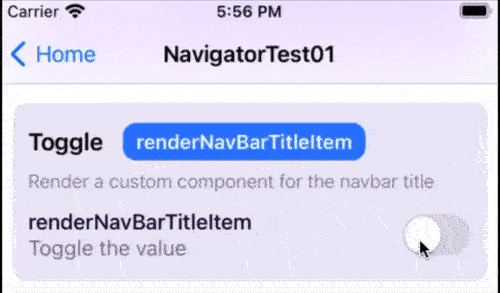

# react-native-ios-navigator

A native wrapper component around `UINavigationController` for react-native.


## 🚧⚠️ **Library WIP** ⚠️🚧

Currently in development... 😅 (See [TODO.md](https://github.com/dominicstop/react-native-ios-navigator/blob/master/docs/TODO.md) for current progress).

<br>

---

<br><br>

## Quick Links

😌💬 Hey there, if you're just checking this library out, I recommend jumping to the [Showcase, Tests, and Demos](#g-showcase-tests-and-demos) section (It has a bunch of gifs showing all the various features).

<br>

| Section + Link                                              | Description                                                  |
| :---------------------------------------------------------- | ------------------------------------------------------------ |
| ⭐️ [Getting Started Guide](PLACE_HOLDER_LINK)                | Discussion + step by step guide (w/ accompanying gifs + screenshots) on how to use this library and its various components.<br><br>**Related Links**:<br>1️⃣ [Installation](#b-installation)<br>2️⃣ [Basic Usage](#c-basic-usage) |
| 💖 [Usage and Examples](#f-usage-and-examples)               | Example usage that covers the various components and functionality of this library. |
| 💫 [Showcase, Tests, and Demos](#g-showcase-tests-and-demos) | Just some gifs, screenshots + vibes that shows what this library can do. |
| 📝 [Documentation](#d-documentation)                         | Documentation for all the various components, functions, types, etc.<br><br>**Sub-Section Links**:<br>1️⃣[`NavigatorView` Component](#d11-navigatorview-component)<br>2️⃣[`RouteViewPortal` Component](#d12-routeviewportal-component)<br/>3️⃣[`RouteViewEvents` Component](#d13-routeviewevents-component)<br>4️⃣[`RouteHeaderView` Component](#d14-routeheaderview-component)<br>5️⃣ [Context](#d2-context)<br>6️⃣ [Hooks](#d3-hooks)<br>7️⃣ [Objects and Types](#d4-objects-and-types)<br>8️⃣ [Native-Related](#d6-native-related) |


---

<br><br>

## A. Introduction

Before you use this library, please first consider looking at [`react-navigation`](https://github.com/react-navigation/react-navigation), [`react-native-navigation`](https://github.com/wix/react-native-navigation), and [`react-router`](https://github.com/ReactTraining/react-router). They offer more features, are battle-tested, well maintained, and most importantly: cross-platform. This library is more of a personal pet project 😌.

<br>

### A.1. Motivation 

#### Expose Everything 

This is a wrapper library, so the goal is (for better, or for worse) to expose almost **everything** to react-native.

I tried to expose, in some way or another, all the ways the `UINavigationController`,  `UINavigationBar`, and `UIViewController` could be configured and customized. Unfortunately, this means that the API + documentation is a little dense/complex, and might be a little bit confusing to non-iOS developers (so I tried to include as much explanations, examples + gifs and images as I could).

<br>

#### Resurrecting `NavigatorIOS`

Basically, `react-native` [deprecated](https://archive.reactnative.dev/docs/0.58/navigatorios#docsNav) the built-in [`NavigatorIOS`](https://archive.reactnative.dev/docs/0.57/navigatorios#docsNav) component starting on version `0.58`.

One thing that I liked about `NavigatorIOS` is that it behaved like any regular old `<View/>` component. Which is fun since you can just plop it down anywhere in your app, and it'll just "work" (this included the weird quirk of having multiple navigators 🤷‍♀️).

<br>

#### 📝 Notes

* Modal support is handled via [`react-native-ios-modal`](https://github.com/dominicstop/react-native-ios-modal) (WIP)
* Adding menu's/submenu's in the navigation bar is handled via [`react-native-ios-context-menu`](https://github.com/dominicstop/react-native-ios-context-menu) (WIP)

<br>

### A.2. Features 

💡 **Tip**: You can also just browse through the gifs/images in the [Showcase, Tests, and Demos](#g-showcase-tests-and-demos) section.

<br>

* Support for using native routes (e.g. `UIViewController`). Allows you to combine  js/react routes and native routes together. 
	* Support for controlling the navigator from native/swift-side (e.g. pushing routes, etc.)
	* Support for passing data (i.e. `routeProps`) between native and JS/React routes.

<br>

* Support for multiple initial react/native routes (useful for state-restoration, e.g. restoring the navigation stack on app startup).
* Support for using custom transitions (e.g. crossfade, slide, flip, etc).
* Support for customizing the navigation bar either through the "legacy" API (iOS 11 and below), or the newer appearance API (iOS 13+).
	* This includes per-route customizations using either the "legacy" or "appearance" modes.
	* Support for:
		* Using routes with a `UISearchBar` in the navigation bar.
		* Using either custom react components or standard navigation bar controls (e.g. buttons, text, icons) for the navigation bar items (e.g. navigation bar title, left items, right items).
		* Customizing the font style of the navigation bar title + large title.
		* Per-route navigation bar visibility and status bar style.
		* Customize the navigation bar tint, background color, background image, back indicator, blur effects, shadow, etc.
		* Support for generating images (e.g. solid colors, gradients, rounded rects, etc) that can be used as the navigation bar background, navigation bar items... basically, anywhere that accepts an image.
		* Etc.

<br>

* Exposes almost all of the `UINavigationController`/`UIViewController`-related events.
* Exposes all of the things that can be configured in the view controller's [`UINavigationItem`](https://developer.apple.com/documentation/uikit/uinavigationitem) (`title`, `prompt`, `largeTitleDisplayMode`, `backBarButtonItem`, etc).
* Etc.

<br>

------

<br><br>

## B. Installation

```sh
# install via npm...
npm install react-native-ios-navigator

# or install via yarn.
yarn add react-native-ios-navigator

# then run pod install (uses auto-linking)
cd ios && pod install
```

<br>

📝 **Note**: This library is written in swift, so if you're having troubles building your project, try adding an empty swift file so that Xcode will generate a `bridging-header.h` file for your project.

<br>

### Additional Setup

In your project's `Info.plist` file, set the "View controller-based status bar appearance" key from `NO` to `YES`. Toggling this property allows you to set the status bar style on a per-route basis.


<br>

### Troubleshooting

The following build errors can usually be resolved by adding an empty swift file:


<br>

However, the older versions of the react-native template (e.g. `0.63` and below) hard codes the swift library search paths to use swift `5.0` (which causes the linker to mismatch the swift system libraries bundled with Xcode + iOS version). To fix this issue, just remove the following entries from the project config's library search path:


<br>

### Versions

| Library Version   | Compatibility                 |
| ----------------- | ----------------------------- |
| `next`            | iOS 10 to iOS 15<br>Xcode 13  |
| `0.3.1` and Below | iOS 10 to iOS 14<br/>Xcode 12 |


------

<br><br>

## C. Basic Usage

This snippet is an excerpt from the [Navigation Hello World](#a01---navigation-hello-world) section.

```jsx
import * as React from 'react';
import { SafeAreaView, TouchableOpacity, Text } from 'react-native';
import { NavigatorView } from 'react-native-ios-navigator';

// Route to show in the navigator
function ExampleRoute(props){
  return (
    <SafeAreaView>
      <TouchableOpacity onPress={() => {
        props.navigation.push({
          routeKey: 'routeA'
        });
      }}>
        <Text> Push: 'RouteA' </Text>
      </TouchableOpacity>
    </SafeAreaView>
  );
};

export function App() {
  return(
    <NavigatorView
      initialRoutes={[{routeKey: 'routeA'}]}
      routes={{
        routeA: {
          renderRoute: () => (
            <ExampleRoute/>
          ),
        }
      }}
    />
  );
};

```


<br>

------

<br><br>

## D. Documentation

💡 **Tip**: Most of the time, when a type or component is mentioned, you can click it to jump to that item in the README (or its declaration in the source code).

<br>

### D.1. Components

#### D.1.1. `NavigatorView` Component

This component is a wrapper around [`UINavigationController`](https://developer.apple.com/documentation/uikit/uinavigationcontroller), and as such, it also facilitates navigation in a stack-like manner (where in routes are "pushed" and "popped" in and out of the navigation stack). Only one route can be shown at a given time. However it is possible to have multiple `NavigatorView` instances at the same time. 

* Each instance will have their own separate navigation stack, allowing you to show multiple routes at once. 
* But do note that the 1st instance will always be treated as the "root" navigation controller, and subsequently, it’ll become responsible for handling things like setting the color of the status bar, etc.

<br>

Internally, each `NavigatorView` component corresponds to a `UINavigationController` instance, and conversely, each route in the navigation stack corresponds to a `UIViewController` instance.

* The “route content” (i.e. the element returned from a route’s `renderRoute` function) gets wrapped inside a view controller instance.
* That view controller is then sent off to the `UINavigationController`.

<br>

Each route has a corresponding `RouteOptions` object associated with it. This object is used internally to configure various aspects of the `UINavigationController`, `UINavigationBar`, `UINavigationItem`, `UIViewController`, etc.

<br>

##### `NavigatorView` Component: Props

###### `NavigatorView` General Props

| Prop Name and Type                                           | Description                                                  |
| :----------------------------------------------------------- | :----------------------------------------------------------- |
| 🔤 **Required**: `routes`<br><br>⚛️ [`NavRoutesConfigMap`](PLACE_HOLDER_LINK) | Configures what routes can be used inside the navigator.<br><br>This prop accepts a `NavRoutesConfigMap` object. This object is a map of `NavRouteConfigItem` objects, where in the key of each property is its `routeKey` (e.g. `{ RouteA: {...}, RouteB: {...} }`).<br><br>These objects are used to create and configure the routes. Those "route config" objects include things like: <br>• **A**. what component to show when the route becomes active (i.e. the `NavRouteConfigItem.renderRoute` property),<br>• **B**. the initial `routeProps` that the route will receive (e.g. `NavRouteConfigItem.initialRouteProps`), and<br>• **C**. other misc. options that'll determine the look of the navigation bar, the route's transitions, etc. (i.e. `NavRouteConfigItem.routeOptionsDefault`). <br><br>📝 **Note**: The `routeKey` for the route config object must be unique for each route item.<br><br>There are actually two types of routes that you can use:<br>• **A**. The first one is a "<u>JS route</u>" (i.e. a route defined in react/js-side using standard react components).<br>• **B**. The second one is a "<u>native route</u>" (i.e. a route defined in the native-side using  native code (e.g. `UIViewController` + storyboards, auto layout, etc).<br><br>📌 For more details check out the [`NavRouteConfigItem`](PLACE_HOLDER_LINK) type, and the [guides](PLACE_HOLDER_LINK) section. |
| 🔤 [**Required**: `initialRoutes`<br><br>⚛️ `Array<NavRouteItem>`](PLACE_HOLDER_LINK) | Used by the navigator to determine which initial routes to show when the navigator first mounts.<br><br>This prop accepts an array of `NavRouteItem` objects. The `routeKey` values in the objects must match with a route configured in the `routes` prop. <br><br>This prop basically represents the navigation stack during the first mount (e.g. with the first item being the root route, and the last item being the topmost active route).<br><br>For example, if you pass `[[{routeKey: 'A'}, {routeKey: 'B'}]]` as the initial routes, then route "A" will become the root route, and route "B" will become the topmost route. Thus, on the first mount  route "B" will first be shown, and by pressing the back button,  route "B" will be popped, and then route "A" will be shown. <br><br>💡 **Tip**: This behavior of being able to set the initial routes is useful for state-restoration (or for when you want to show a different initial route based on some condition). |
| 🔤 `style`<br/><br>⚛️ `ViewStyle`                              | The style applied to the the `NavigatorView` component itself.<br><br>📝 **Note**: The layout size of the `NavigatorView` will also determine the layout size of the routes, so if the size of the navigator is 100 x 100, then the routes will also be 100 x 100. |
| 🔤 `navBarPrefersLargeTitles`<br/><br>⚛️ `boolean`<br><br>✳️ **Default**: `true` on iOS 11+ | Specifies whether or not to use the large title style for the navigation bar title. Defaults to `true` on iOS 11 and above.<br><br>Maps to the [`UINavigationBar.prefersLargeTitle`](https://developer.apple.com/documentation/uikit/uinavigationbar/2908999-preferslargetitles) property,<br><br>📝 **Note**: This prop can be overridden on a per route basis either via `largeTitleDisplayMode` in the `NavigatorView.routes` prop, or via the `RouteViewPortal.routeOptions` prop.<br/> |
| 🔤  `navBarAppearance`<br/><br>⚛️ [`NavBarAppearanceCombinedConfig`](PLACE_HOLDER_LINK) | This prop allows for the customization of the [`UINavigationBar`](https://developer.apple.com/documentation/uikit/uinavigationbar). The navigation bar can be customized via two modes, namely:<br>• **A**. "legacy" mode (iOS 12 and below), and<br>• **B**. "appearance" mode (iOS 13 and above).<br><br>The "legacy" mode, as the name would suggest, uses ["legacy customizations"](https://developer.apple.com/documentation/uikit/uinavigationbar/legacy_customizations)  (where in the navigation bar is customized using the old API via directly manipulating the navigation bar object's properties).<br><br>The "appearance" mode on the other hand, uses `UINavigationBarAppearance` to apply customizations for each of the "navigation bar" styles/states, namely:<br>1️⃣  `standardAppearance` (normal height),<br>2️⃣ `compactAppearance` (compact-height, e.g. iPhones in landscape, etc.),<br>3️⃣  `scrollEdgeAppearance` (when the navigation bar doesn't have content behind it and is currently scrolled all the way to the top), and <br>4️⃣ `compactScrollEdgeAppearance` (a combination of compact and scroll edge, requires iOS 15+) .<br><br>📝 **Note**: There is one big caveat though, once "appearance" mode is used, "legacy" mode no longer works (it's some sort of bug in `UIKit`). In other words, switching between the two modes is not supported, only stick to one. When targeting iOS 12 and below, use "legacy", otherwise use "appearance".<br><br>💡 **Tip**: Check the [guides](PLACE_HOLDER_LINK) section for examples on how to customize the navigation bar, or browse the [`NavBarAppearanceCombinedConfig`](PLACE_HOLDER_LINK) object for the full list of properties.<br><br>💡 **Tip**: The navigation bar can also be customized on a per-route basis via the `RouteOptions.navBarAppearanceOverride`. You can set this property either via `routeOptionsDefault` in a route's config (in the `NavigatorView.routes` prop), or via the [`RouteViewPortal`](PLACE_HOLDER_LINK) component using the `RouteViewPortal.routeOptions` prop. |
| 🔤 `isNavBarTranslucent`<br/><br>⚛️ `boolean`                  | Determines whether or not the the navigation bar is translucent. Maps to [`UINavigationBar.isTranslucent`](https://developer.apple.com/documentation/uikit/uinavigationbar/1624928-istranslucent). |
| `isInteractivePopGestureEnabled`<br/><br>⚛️ `boolean`         | Enables or disables the `interactivePopGestureRecognizer`. In other words, this prop sets whether swiping on the left edge of the screen will pop the current route. Defaults to `true`. |
| 🔤 `shouldSwizzleRootViewController`<br/><br>⚛️ `boolean`      | Determines whether or not the root view controller's default implementation is changed at run-time (i.e. "swizzled") to enable certain features (e.g. like enabling "view controller based status bar" via delegating `childForStatusBarStyle` to a child view controller, etc).<br><br>The "injected" implementation is lifted from [`RNIRootViewController`](PLACE_HOLDER_LINK). <br><br>Defaults to `true`, however this will only take effect for the first `NavigatorView` component, and also only if the parent view controller is the same instance as the one in `window.rootViewController`.<br><br>For brownfield projects with native code (or for projects with an existing navigation solution), set this to `false` to disable this behavior. |
| 🔤 `disableTransparentNavBarScrollEdgeAppearance`<br/><br/>⚛️ `boolean`<br/><br>✳️ **Default**: `true` | In iOS 15+ the navigation bar by default is now configured to have a transparent background until the user scrolls and there's some content behind the navigation bar (i.e. the `scrollEdgeAppearance` is now configured to be transparent by default).<br><br>This prop determines whether or not to apply a  background color to navigation bar using `scrollEdgeAppearance` . Set this to false if you want to keep the default behavior<br><br>📝 **Note A**: You can manually do what this prop does by providing your own `scrollEdgeAppearance` appearance config either globally via the `NavigatorView.navBarAppearance` prop, or on a per-route basis via the `RouteOptions.navBarAppearanceOverride` property.<br/><br/>📝 **Note B**: This prop only takes effect on iOS 15+ and when a route disables the large title. This prop does not affect native routes. |

alsp<br>

###### `NavigatorView` Render Props

| Prop Name and Type                                           | Description                                                  |
| :----------------------------------------------------------- | ------------------------------------------------------------ |
| 🔤 `renderNavBarLeftItem`<br><br>⚛️ [`RenderNavItem`](PLACE_HOLDER_LINK) i.e. `(navigation: NavigationObject) => ReactElement ¦ null ¦ undefined`<br/><br/>📌 [`navigation: NavigationObject`](PLACE_HOLDER_LINK) | Sets a default left item for the navigation bar for all the routes.<br><br>📝 **Note A**: The left navigation bar item can be overridden/replaced on a per route basis via `NavRouteConfigItem.renderNavBarLeftItem` in the `NavigatorView.routes` prop, or via  `RouteViewPortal.renderNavBarLeftItem` prop.<br><br>📝 **Note B**: If this prop is used, it'll implicitly set `RouteOptions.navBarButtonLeftItemsConfig` to `{ type: 'CUSTOM' }` for a route's  `routeOptions`. So if the `navBarButtonLeftItemsConfig` is explicitly set to anything other than "custom", then this prop will not do anything.<br><br>📝 **Note C**: If a route's `RouteOptions.leftItemsSupplementBackButton`  is set to `false` (which it isn't by default), then it will replace the back button (i.e. the back button will not be shown). |
| 🔤 `renderNavBarRightItem`<br/><br>⚛️ [`RenderNavItem`](PLACE_HOLDER_LINK) i.e. `(navigation: NavigationObject) => ReactElement ¦ null ¦ undefined`<br/><br/>📌 [`navigation: NavigationObject`](PLACE_HOLDER_LINK) | Sets a default right item for the navigation bar for all the routes.<br/><br/>📝 **Note A**: The right navigation bar item can be overridden/replaced on a per route basis via `NavRouteConfigItem.renderNavBarRightItem` in the `NavigatorView.routes` prop, or via  `RouteViewPortal.renderNavBarRightItem` prop.<br/><br/>📝 **Note B**: If this prop is used, it'll implicitly set `RouteOptions.navBarButtonRightItemsConfig` to `{ type: 'CUSTOM' }` for a route's  `routeOptions`. So if the `navBarButtonRightItemsConfig` is explicitly set to anything other than "custom", then this prop will not do anything. |
| 🔤 `renderNavBarTitleItem`<br/><br>⚛️ [`RenderNavItem`](PLACE_HOLDER_LINK) i.e. `(navigation: NavigationObject) => ReactElement ¦ null ¦ undefined`<br/><br/>📌 [`navigation: NavigationObject`](PLACE_HOLDER_LINK) | Sets a default title item for the navigation bar for all the routes.<br/><br/>📝 **Note**: The title navigation bar item can be overridden/replaced on a per route basis via `NavRouteConfigItem.renderNavBarTitleItem` in the `NavigatorView.routes` prop, or via  `RouteViewPortal.renderNavBarTitleItem` prop.<br/><br/>💡 **Tip**: You can access the route's `routeTitle` via the `navigation` object (i.e. `navigation.routeOptions.routeTitle`). |

<br>

###### `NavigatorView` Event Props

| Prop Name and Type                                           | Description                                                  |
| :----------------------------------------------------------- | ------------------------------------------------------------ |
| 🔤 `onNavRouteWillPop`<br/><br/>⚛️ [`OnNavRoutePopEvent`](PLACE_HOLDER_LINK)<br><br>📌 [`OnNavRoutePopEventObject`](src/types/RNINavigatorViewEvents.ts) | Event that is triggered when a route is about to be "popped" from the navigation stack (i.e. when the pop transition has started). |
| 🔤 `onNavRouteDidPop`<br><br>⚛️ [`OnNavRoutePopEvent`](PLACE_HOLDER_LINK)<br><br>📌 [`OnNavRoutePopEventObject`](src/types/RNINavigatorViewEvents.ts) | Event that is triggered when a route has been "popped" from the navigation stack (i.e. the pop transition has already been completed). |
| 🔤 `onCustomCommandFromNative`<br><br>⚛️ [`OnCustomCommandFromNativeEvent`](PLACE_HOLDER_LINK)<br><br>📌 [`OnCustomCommandFromNativeEventObject`](src/types/RNINavigatorViewEvents.ts) | Event that is triggered from the native-side via the `RNINavigatorNativeCommands.sendCustomCommandToJS` delegate method.<br><br>This event exists to receive custom user-defined commands from a `RNINavigatorView` (i.e. for custom native code integration). |
| 🔤 `onNavRouteWillShow`<br/><br/>⚛️ [`OnNavRouteWillShowEvent`](PLACE_HOLDER_LINK)<br/><br/>📌 [`OnNavRouteWillShowEventObject`](src/types/RNINavigatorViewEvents.ts) | Gets called just before the navigator shows the route (similar to `onRouteWillFocus` event).<br><br>This event maps to [`UINavigationControllerDelegate.navigationController(_:willShow:animated:)`](https://developer.apple.com/documentation/uikit/uinavigationcontrollerdelegate/1621878-navigationcontroller). |
| 🔤 `onNavRouteDidShow`<br/><br/>⚛️ [`OnNavRouteDidShowEvent`](PLACE_HOLDER_LINK)<br/><br/>📌 [`OnNavRouteDidShowEventObject`](src/types/RNINavigatorViewEvents.ts) | Gets called after the navigator shows the route (similar to `onRouteDidFocus` event).<br/><br/>This event maps to [`UINavigationControllerDelegate.navigationController(_:didShow:animated:)`](https://developer.apple.com/documentation/uikit/uinavigationcontrollerdelegate/1621848-navigationcontroller). |
| 🔤 `onUIConstantsDidChange`<br/><br/>⚛️ [`OnUIConstantsDidChangeEvent`](PLACE_HOLDER_LINK)<br/><br/>📌 [`OnUIConstantsDidChangeEventObject`](src/types/RNINavigatorViewEvents.ts) | Gets called whenever the UI-related constants changes (e.g. this event is triggered when the screen rotates, the navigation bar visibility is changed, etc).<br><br>The event object contains the current safe area values, status bar height, and the navigator frame.<br><br>💡 **Tip**: You can also access the UI constants via `NavigatorUIConstantsContext` or via the `useNavigatorUIConstants` hook. |

<br>

##### `NavigatorView` Component: Properties/Methods

###### `NavigatorView` General/Misc. Methods

| Name                                                         | Description                                                  |
| :----------------------------------------------------------- | ------------------------------------------------------------ |
| 🔤 `getActiveRoutes`<br/><br/>⚛️ [`() => Array<NavRouteStackItem>`](PLACE_HOLDER_LINK) | Returns an array of `NavRouteStackItem` objects that represents the current state of the  navigation stack.<br><br>This method is useful for getting the `routeIndex` of a particular route, or for getting the current active routes. |
| 🔤 `sendCustomCommandToNative`<br/><br/>⚛️ `(commandKey: string, commandData: object ¦ null) => Promise<object ¦ null>` | Will trigger  the `RNINavigatorViewDelegate.didReceiveCustomCommandFromJS` delegate method for the current navigator view instance.<br><br>This method exists to send custom user-defined commands to the `RNINavigatorView`'s delegate (i.e. for custom native code integration).<br><br>📌 Check the [native integration guide](PLACE_HOLDER_LINK) section for more details. |
| 🔤 `getNavigatorConstants`<br/><br/>⚛️ [`() => Promise<NavigatorConstantsObject>`](PLACE_HOLDER_LINK) | Resolves to an object containing values related to UI (e.g. `navBarHeight`, navigator bounds, `safeAreaInsets`, `statusBarHeight`), and the current state of the navigator (e.g. whether a view controller is being presented modally, the current  `activeRoutes`, the current topmost view controller, and the current visible view controller). |
| 🔤 `dismissModal`<br/><br/>⚛️ [`(animated: Bool) => Promise<void>`](PLACE_HOLDER_LINK) | This will close any modals that are currently being presented. |

<br>

###### `NavigatorView` Navigation Commands

Listed in this section are commands that can be called to control the navigator (e.g. like showing or hiding a route, replacing a route in the navigation stack, etc). Unless specified otherwise, the commands listed here are really just invoking [`UINavigationController.setViewControllers`](https://developer.apple.com/documentation/uikit/uinavigationcontroller/1621861-setviewcontrollers) internally in the native side. 

* The navigation commands are asynchronous, and as such, they will return a promise that resolves once the command is completed.
* Due to timing related issues, the `NavigatorView` internally has a command queue, as such, only one command can be executed at a given time. 
* So for example if you call `push`, then call `pop` immediately (i.e. not waiting for `push` to complete first before calling `pop`), they will always be executed in that order (i.e. it will always wait for the previous command to complete).

<br>

| Name and Type                                                | Description                                                  |
| :----------------------------------------------------------- | ------------------------------------------------------------ |
| 🔤 `push`<br/><br/>⚛️ `(routeItem, options?) => Promise<void>`<br/><br/>📌 [`routeItem: NavRouteItem`](PLACE_HOLDER_LINK)<br>📌 [`options: NavCommandPushOptions`](PLACE_HOLDER_LINK) | Push a new route into the navigation stack. The `routeItem` to be pushed must be a route that is declared in the `NavigatorView.routes` prop. This command maps to the  [`UINavigationController.pushViewController`](https://developer.apple.com/documentation/uikit/uinavigationcontroller/1621887-pushviewcontroller) method.<br><br>The `routeItem` parameter accepts a `NavRouteItem` object. Via this object you can define what route to show using the `NavRouteItem. routeKey` property. You can also pass data to the new route using the `NavRouteItem.routeProps`  property, or optionally pass new route options via the `NavRouteItem.routeOptions` property.<br><br>💡 **Tip**: You can set a temporary push transition (e.g. `FadePush`, `SlideLeftPush`, etc), or disable the transition animation entirely via the `options` parameter. |
| 🔤 `pop`<br/><br/>⚛️ `(options?) => Promise<void>`<br/><br/>📌 [`options: NavCommandPopOptions`](PLACE_HOLDER_LINK) | Pop the current active route out of the navigation stack. This command maps to the  [`UINavigationController.popViewController`](https://developer.apple.com/documentation/uikit/uinavigationcontroller/1621886-popviewcontroller) method.<br><br/>💡 **Tip**: You can set a temporary pop transition (e.g. `FadePop`, `SlideLeftPop`, etc.), or disable the transition animations entirely via the `options` parameter. |
| 🔤 `popToRoot`<br/><br/>⚛️ `(options?) => Promise<void>`<br/><br>📌 [`popToRoot: NavCommandPopOptions`](PLACE_HOLDER_LINK) | Pop all the routes except the first route in the navigation stack. This can be used as a quick way to go back to the root route.<br><br>This command maps to the  [`UINavigationController.popToRootViewController`](https://developer.apple.com/documentation/uikit/uinavigationcontroller/1621855-poptorootviewcontroller) method. |
| 🔤 `removeRoute`<br/><br/>⚛️ `(routeIndex: number, animated?: boolean = false) => Promise<void>` | Removes a specific route from the navigation stack. The argument passed to `routeIndex` determines which route to remove from the navigation stack (e.g. a value of `0` means to move the root route, and so on).<br><br>• 💡 **Tip**: You can call `getActiveRoutes` to get the current state of the navigation stack.<br><br/>• 💡 **Tip**: This command is useful for situations where in a given route in the navigation stack becomes "stale", i.e. it no longer makes sense to show that route when navigating backwards.<br><br>• An example could be a user navigating from a "registration" route, to a "registration success" route. If the back button is pressed, it doesn't make sense for the "registration" route to appear again, so you remove it from the navigation stack. |
| 🔤 `removeRoutes`<br/><br/>⚛️ `(routeIndices: number, animated?: boolean = false) => Promise<void>` | Removes  the specified routes from the navigation stack. The argument passed to `routeIndices` determines which routes to remove from the navigation stack, where a value of `0` means to remove the root route, and so on.<br><br>This command is similar to `removeRoute`, but this lets you remove multiple routes at once.<br><br>💡 **Tip**: You can call `getActiveRoutes` to get the current state of the navigation stack.<br><br>💡 **Tip**: Similar to `removeRoute`, this command is useful for selectively removing routes that have gone "stale" all at once. |
| 🔤 `replaceRoute`<br/><br/>⚛️ `(prevRouteIndex: number, routeItem: NavRouteItem, animated?: boolean = false) => Promise<void>`<br><br>📌 [`routeItem: NavRouteItem`](PLACE_HOLDER_LINK) | Replaces an existing active route in the navigation stack with a new route that matches the  specified `prevRouteIndex` argument.<br><br>A new route will be created based on the specified `routeItem` provided, and it will then be used as the replacement route. <br><br>📝 **Note**: Just like the `push` command, the `routeItem` must be a route that is declared in the `NavigatorView.routes` prop.<br><br>💡 **Tip**: You can call `getActiveRoutes` to get the current state of the navigation stack. |
| 🔤 `insertRoute`<br/><br/>⚛️ `(routeItem: NavRouteItem, atIndex: number, animated?: boolean = false) => Promise<void>`<br><br>📌 [`routeItem: NavRouteItem`](PLACE_HOLDER_LINK) | Similar to the `push` command, this lets you create a new route based on the provided `routeItem`, and then add it to the navigation stack. But instead of only being able to add routes to the top, this command let's you arbitrarily add a route anywhere in the navigation stack based on the provided `atIndex` argument.<br/><br/>📝 **Note**: The `routeItem` to be added must be a route that is declared in the `NavigatorView.routes` prop, and the `atIndex` argument must not exceed the current size of the stack. |
| 🔤 `setRoutes`<br/><br/>⚛️ `(transform: SetRoutesTransformCallback, animated?: boolean = false) => Promise<void>`<br><br>📌 [`transform: SetRoutesTransformCallback`](PLACE_HOLDER_LINK)<br>📌 [`NavRouteStackPartialItem`](PLACE_HOLDER_LINK) | Allows for the manipulation of the current routes in the navigation stack. Amongst all the navigation commands, this is the most flexible (and complex) because it allows you to add, remove, reorder, replace, or completely change the current active routes in navigation stack.<br><br>The `transform` parameter accepts a function callback that, when called, will receive an array of objects that represents the current active routes in the navigation stack.<br><br>The `transform` callback must then return an array of route objects that will be used to set the new navigation stack (i.e. the new routes that will replace the current active routes).<br><br>Any of the previous active routes that are not returned from the `transform` callback will be removed from the navigation stack, and conversely, any new routes that weren't in the previous active routes will be created, and then added to the navigation stack.<br><br>📝 **Note**: The `transform` callback will receive an array of [`NavRouteStackPartialItem`](PLACE_HOLDER_LINK) objects that represents the current active routes in the navigation stack. This object has an optional property called `routeID`. The number value in the `routeID` property is auto-generated internally, and acts as a unique identifier for a route (as such, existing active routes in the navigation stack will have an existing associated `routeID`).<br><br>If the `transform` callback returns a `NavRouteStackPartialItem` object that does not have a `routeID`, then it means that it's a new route (i.e. it will create a new route based on that object, and then add it to the navigation stack).<br><br>Conversely, in order to "preserve" an active route and let it  remain in the navigation stack, then simply return that route's corresponding object from the `NavRouteStackPartialItem` items along with its associated  `routeID` value.  <br><br>💡 **Tip**: This command is useful if you need complete control over the navigation stack. Amongst all the other navigation commands, this is the most direct mapping to [`UINavigationController.setViewControllers`](https://developer.apple.com/documentation/uikit/uinavigationcontroller/1621861-setviewcontrollers). Jump to the [`setRoutes` guides section](PLACE_HOLDER_LINK) for usage examples. |
| 🔤 `setNavigationBarHidden`<br/><br/>⚛️ `(isHidden: boolean, animated: boolean) => Promise<void>` | Programmatically shows or hides the navigation bar. Maps to the [`UINavigationController.setNavigationBarHidden`](https://developer.apple.com/documentation/uikit/uinavigationcontroller/1621885-setnavigationbarhidden) method.<br><br>💡 **Tip**: If you want to immediately hide the navigation bar when a route is pushed (i.e. you don't want the navigation bar to be visible when that route is pushed), you can use the `RouteOptions.navigationBarVisibility` property instead.<br><br>The `navigationBarVisibility` property can either be set via `routeOptionsDefault` (which can be found in the route's config in the `NavigatorView.routes` prop), or via the [`RouteViewPortal`](PLACE_HOLDER_LINK) component using the `RouteViewPortal.routeOptions` prop.<br><br>💡 **Tip**: Like all the other navigation commands, this command is also async. So this command is useful if you want to wait for the navigation bar hide animation to finish first before doing something else. |

<br>

###### `NavigatorView` Convenience Navigation Commands

These are basically "presets" to existing navigation commands i.e. it uses the existing navigation commands available to provide shortcuts to common navigation actions for convenience.<br>

| Name and Type                                                | Description                                                  |
| :----------------------------------------------------------- | ------------------------------------------------------------ |
| 🔤 `replacePreviousRoute`<br/><br/>⚛️ `(routeItem: NavRouteItem, animated?: boolean = false) => Promise<void>`<br><br>📌 [`routeItem: NavRouteItem`](PLACE_HOLDER_LINK) | Replaces the previous route in the navigation stack with a new route. |
| 🔤 `replaceCurrentRoute`<br/><br/>⚛️ `(routeItem: NavRouteItem, animated?: boolean = false) => Promise<void>`<br><br>📌 [`routeItem: NavRouteItem`](PLACE_HOLDER_LINK) | Replaces the current route (i.e. the topmost route) in the navigation stack with a new route. |
| 🔤 `removePreviousRoute`<br/><br/>⚛️ `(animated?: boolean = false) => Promise<void>` | Removes the previous route in the navigation stack.          |
| 🔤 `removeAllPrevRoutes`<br/><br/>⚛️ `(animated?: boolean = false) => Promise<void>` | Removes all of the previous routes in the navigation stack.  |

<br>

#### D.1.2. `RouteViewPortal` Component

The purpose of this component is to allow for the customization of a route after it's been pushed.

* E.g. like dynamically overriding/updating a route's `RouteOptions`, or rendering custom components to show inside the navigation bar, etc. 

📝 **Note**: The reason why this component has the "portal" suffix is because it's "transporting" things like the route options and the render props somewhere else.

This component is meant to be used inside a route (i.e. it must be used inside the `renderRoute` function in the `NavigatorView.routes` prop). This is because internally, this component relies on react context to communicate to the parent `NavigatorRouteView` component. 

For some extra background info, the `NavigatorRouteView` component is responsible for: 

* **A**. rendering the component returned by `renderRoute`,
* **B**. managing the route's lifecycle, and
* **C**. communicating with the native views/modules, etc.

As such this component doesn't actually render anything directly, it's merely an intermediate component to pass things along. 

* The components you pass to  the `RouteViewPortal` are actually being rendered in different place in the component tree.
* Keep this in mind when using things like react context and state (this is a limitation I'm currently trying to fix).

<br>

#####  `RouteViewPortal` Component: Props

| Prop Name and Type                                           | Description                                                  |
| :----------------------------------------------------------- | ------------------------------------------------------------ |
| 🔤  `routeOptions`<br/><br/>⚛️ [`RouteOptions`](PLACE_HOLDER_LINK) | This prop will override the existing route options that were provided either from **A**. its route config (i.e. the `NavRouteConfigItem.routeOptionsDefault`), or **B**. the route options override provided via a navigation command (e.g. `navigation.push({..., routeOptions: {...}})`).<br><br>This prop is basically just a convenient wrapper around `navigation.setRouteOptions` (i.e. it’s just calling this command on your behalf whenever you provide a new value).<br><br>💡 **Tip**: This prop is useful for dynamically changing the current route options based on some condition.<br><br>For example, you can change the navigation bar title after loading a resource, or temporarily hide the back button while loading, etc. |
| 🔤 `renderNavBarLeftItem`<br/><br/>⚛️ [`(navigation) => ReactElement`](PLACE_HOLDER_LINK) | This prop is used for rendering a custom left item component in the navigation bar.<br><br>If `leftItemsSupplementBackButton` in `routeOptions`  is set to `true` (which it is by default), then it will replace the back button (i.e. the back button will not be shown).<br><br>📝 **Note**: If this prop is used, it'll implicitly set `navBarButtonLeftItemsConfig` to `{ type: 'CUSTOM' }` for a route's  `routeOptions`. So if the `navBarButtonLeftItemsConfig` is explicitly set to anything other than "custom", then this prop will not do anything. |
| 🔤 `renderNavBarRightItem`<br/><br/>⚛️ [`(navigation: NavigationObject) => ReactElement`](PLACE_HOLDER_LINK) | This prop is used for rendering a custom right item component in the navigation bar.<br/><br/>📝 **Note**: If this prop is used, it'll implicitly set `navBarButtonRightItemsConfig` to `{ type: 'CUSTOM' }` for a route's  `routeOptions`. So if the `navBarButtonRightItemsConfig` is explicitly set to anything other than "custom", then this prop will not do anything. |
| 🔤 `renderNavBarTitleItem`<br/><br/>⚛️ [`(navigation: NavigationObject) => ReactElement`](PLACE_HOLDER_LINK) | This prop is used for rendering a custom title item component in the navigation bar.<br><br>💡 **Tip**: You can access the route's `routeTitle` via the `navigation` object (i.e. `navigation.routeOptions.routeTitle`). |
| 🔤 `renderRouteHeader`<br/><br/>⚛️ [`(navigation: NavigationObject) => ReactElement`](PLACE_HOLDER_LINK) | This prop allows you to render a header at the top of the screen (check out [`NavigatorShowcase01`](PLACE_HOLDER_LINK) and [`NavigatorShowcase02`](PLACE_HOLDER_LINK) for examples).<br><br>This prop accepts a function that must return a [`RouteHeaderView`](PLACE_HOLDER_LINK) as the root element. This component integrates with the route in the native side to enable the header behavior. Check the documentation for [`RouteHeaderView`](PLACE_HOLDER_LINK) for more details. |

<br>

##### `RouteViewPortal` Example

* 📌 **Declaration**: [`RouteViewPortalExample01.tsx`](example/src/routes/RouteViewPortalExample01.tsx)


```jsx
// 📝 Note: for the sake of brevity, some of the code is omitted...
export function RouteViewPortalExample01(){
  const [index, setIndex] = React.useState(0);

  return (
    <SafeAreaView style={styles.routeContainer}>
      <RouteViewPortal
        routeOptions={{
          // Change the navigation bar title text
          routeTitle: `index: ${index}`,

          // Disable large tile
          largeTitleDisplayMode: 'never',

          // Set the status bar tint to 'white'
          statusBarStyle: 'lightContent',
          
          // Customize navigation bar appearance...
          navBarAppearanceOverride: {
            mode: 'appearance',
            useStandardAppearanceAsDefault: true,

            standardAppearance: {
              // Set the navigation bar tint to red
              backgroundColor: Colors.RED.A700,

              // Make the back button text white
              backButtonAppearance: {
                style: 'plain',
                normal: {
                  titleTextAttributes: {
                    color: 'white',
                    fontSize: 16,
                    fontWeight: '600',
                  },
                },
              },

              // Make the back button icon white
              backIndicatorImage: {
                type: 'IMAGE_SYSTEM',
                imageValue: {
                  systemName: 'chevron.left',
                  weight: 'semibold',
                },
                imageOptions: {
                  tint: 'white',
                  renderingMode: 'alwaysOriginal',
                },
              },
            }
          },
        }}

        // Use a custom component for navigation bar title
        renderNavBarTitleItem={({routeOptions}) => (
          <TouchableOpacity 
            style={styles.buttonContainer}
            onPress={() => {
              // Reset the index when pressed
              setIndex(0);
            }}
          >
            <Text style={styles.buttonLabel}>
              {routeOptions.routeTitle ?? 'N/A'}
            </Text>
          </TouchableOpacity>
        )}

        // Use a custom component for navigation bar right item
        renderNavBarRightItem={() => (
          <View style={styles.navBarLeftItemContainer}>
            <TouchableOpacity
              style={[styles.buttonContainer, styles.buttonRightSpace]}
              onPress={() => {
                // Decrement the index when pressed
                setIndex(prevIndex => (prevIndex - 1));
              }}
            >
              <Text style={styles.buttonLabel}>
                {`--`}
              </Text>
            </TouchableOpacity>
            <TouchableOpacity
            style={styles.buttonContainer}
            onPress={() => {
              // Increment the index when pressed
              setIndex(prevIndex => (prevIndex + 1));
            }}
          >
            <Text style={styles.buttonLabel}>
              {`++`}
            </Text>
          </TouchableOpacity>
          </View>
        )}
      />
      <View style={styles.rootContainer}>
        <Text style={styles.textTitle}>
          {`Current Index: ${index}`}
        </Text>
      </View>
    </SafeAreaView>
  );
};
```


<br>

#### D.1.3. `RouteViewEvents` Component

This component allows you to subscribe and listen to the route-related events for the current route.

* E.g. these events include things like: when a route is about to be pushed or popped, or when a navigation bar item has been pressed, etc. 

Similar to the `RouteViewPortal` component:

*  **1**. this component doesn't actually render anything, and 
*  **2**. this component is also required to be used inside a route. 
	* This is because, like the `RouteViewPortal` component, this component also relies on react context to communicate to the parent `NavigatorRouteView` component and receive the route-related events.

Internally, every route has an associated event emitter (i.e. a  [`NavigatorRouteViewEventEmitter`](PLACE_HOLDER_LINK) instance).

* The route's event emitter can be accessed via the route's navigation object (e.g.  `NavigationObject.getRefToNavRouteEmitter`). 
* Internally, this component uses the route's event emitter object to subscribe and listen to the route events.
* 💡 **Tip**: As an alternative, there's also the [`useNavRouteEvents`](PLACE_HOLDER_LINK) hook.

Here is a list a list of the event props that this component supports. The various route-related events are documented and explained in the [`NavigatorRouteViewEvents`](PLACE_HOLDER_LINK) section.

<br>

* [Push/Pop-related Events](PLACE_HOLDER_LINK)
	* `onRouteWillPush`
	* `onRouteDidPush`
	* `onRouteWillPop`
	* `onRouteDidPop`
* [Focus/Blur-related Events](PLACE_HOLDER_LINK)
	* `onRouteWillFocus`
	* `onRouteDidFocus`
	* `onRouteWillBlur`
	* `onRouteDidBlur`
* [Navigation Bar Item-related Events](PLACE_HOLDER_LINK)
	* `onPressNavBarLeftItem`
	* `onPressNavBarRightItem`
* [Search Bar-Related Events](PLACE_HOLDER_LINK)
	* `onUpdateSearchResults`
	* `onSearchBarCancelButtonClicked`
	* `onSearchBarSearchButtonClicked`

<br>

##### `RouteViewEvents` Component Example

```jsx
import { RouteViewEvents } from 'react-native-ios-navigator';

// Route to show in the navigator
function ExampleRoute(props){
  return (
    <SafeAreaView>
      <RouteViewEvents
        onRouteDidPush={({nativeEvent}) => {
          console.log(`Route ${nativeEvent.routeKey} was pushed...`);
        }}
      />
    </SafeAreaView>
  );
};
```

<br>

#### D.1.4. `RouteHeaderView` Component

A common UI navigation pattern is having a large header at the very top of the screen that acts as the centerpiece for a route.

* That header will either remain at a fixed size, or expand and collapse during scrolling.
* Check out [`NavigatorShowcase01`](PLACE_HOLDER_LINK), [`NavigatorShowcase02`](PLACE_HOLDER_LINK) and [`NavigatorShowcase03`](PLACE_HOLDER_LINK) for some examples.

The navigation bar cannot be easily customized (this is especially true you're trying to change the height).

* As such, this makes things like extending the navigation bar's height to show some custom UI elements underneath the title bar very difficult.
* It's also undesirable to create a custom built solution because the built-in navigation bar has a lot of expected native behaviors/functionality that will be hard to re-create (transitions, the back button, etc). 
* To workaround this, some apps (e.g. spotify's album/playlist screen, etc) will just make the navigation bar's background transparent, and then show their custom UI elements underneath it.
	* Other apps (like twitter's profile screen) will simply just hide navigation bar entirely, and show their own custom view (you can also do that using this library by pushing a route with `RouteOptions.navigationBarVisibility`).


This component uses the "transparent navigation bar" approach. When in use, this component is displayed behind the navigation bar, and is anchored to the top of the screen.

* The header can either have a fixed height, or it can be paired with a scroll view so that the header will expand or collapse as the user scrolls.
* In order for your "custom navigation bar" to receive touch events, set `RouteOptions.allowTouchEventsToPassThroughNavigationBar` to `true`.

<br>

##### `RouteHeaderView` Component Props

| Prop Name and Type                                           | Description |
| :----------------------------------------------------------- | ----------- |
| 🔤 **Required**: `config`<br/><br/>⚛️ [`RouteHeaderConfig`](PLACE_HOLDER_LINK) | TBA         |
| 🔤 `headerTopPadding`<br/><br/>⚛️ [`HeaderHeightConfig`](PLACE_HOLDER_LINK) | TBA         |
| 🔤 `style`<br/><br/>⚛️  `ViewStyle`                            | TBA         |

<br>

### D.2. Context

#### D.2.1. `NavigationContext`

Lorum Ipsum<br>

| Name and Type                                                | Description |
| :----------------------------------------------------------- | ----------- |
| 🔤 `routeID`<br/><br/>⚛️ `abc`                                 |             |
| 🔤 `abc`<br/><br/>⚛️ `abc`                                     |             |
| 🔤 `abc`<br/><br/>⚛️ `abc`                                     |             |

<br>

#### D.2.2. `NavigatorUIConstantsContext`

Lorum Ipsum<br>

| Name and Type            | Description |
| :----------------------- | ----------- |
| 🔤 `abc`<br/><br/>⚛️ `abc` |             |
| 🔤 `abc`<br/><br/>⚛️ `abc` |             |
| 🔤 `abc`<br/><br/>⚛️ `abc` |             |

<br>

### D.3. Hooks

#### D.3.1.  `useNavRouteEvents`

#### D.3.2.  `useNavigation`

#### D.3.2.  `useNavigatorUIConstants`

<br>

### D.4. Objects and Types

This library is written using typescript. As such, all of the objects/types mentioned in the documentation (and all of the types exported by the library) will have a corresponding type declaration. Those type declaration can usually be found in the [`src/types`](src/types) directory. If a particular object is not documented here, please refer to those type declaration files instead.

<br>

#### 📄 `TSEventEmitter.ts`

* 📌 **Declaration**: [`TSEventEmitter.ts`](src/functions/TSEventEmitter.ts)

#####  Object Class: `TSEventEmitter.ts`

Lorum Ipsum<br>

| Name and Type            | Description |
| :----------------------- | ----------- |
| 🔤 `abc`<br/><br/>⚛️ `abc` |             |
| 🔤 `abc`<br/><br/>⚛️ `abc` |             |

<br>

#### 📄 `NavigatorRouteViewEventEmitter.ts`

* 📌 **Declaration**: [`NavigatorRouteViewEventEmitter,ts`](src/types/NavigatorRouteViewEventEmitter.ts)

#####  Type: `NavigatorRouteViewEventEmitter`

This type represents a route's event emitter that is used to broadcast and listen to route-related events (e.g. route lifecycle, navigation bar-related events, etc). The route event emitter is a  `TSEventEmitter` object instance that is pre-typed with an event map based on the `NavigatorRouteViewEvents` enum.

<br>

#####  Enum: `NavigatorRouteViewEvents

###### `NavigatorRouteViewEvents` Push/Pop-related Events

These events are triggered when the current route is about to be pushed or popped from the navigation stack.<br>

| Enum Key and Event Type                                      | Description                                                  |
| :----------------------------------------------------------- | ------------------------------------------------------------ |
| 🔤 `onRouteWillPush`<br/><br/>⚛️ [`OnRoutePushEvent`](PLACE_HOLDER_LINK)<br/><br/>📌 [`OnRoutePushEventObject`](src/types/RNINavigatorViewEvents.ts) | An event that is triggered when the current route is about to be pushed into the navigation stack (i.e. the push transition has begun). Internally, this event is triggered just before the [`UINavigationController.pushViewController`](https://developer.apple.com/documentation/uikit/uinavigationcontroller/1621887-pushviewcontroller) method is called. |
| 🔤 `onRouteDidPush`<br/><br/>⚛️ [`OnRoutePushEvent`](PLACE_HOLDER_LINK)<br/><br/>📌 [`OnRoutePushEventObject`](src/types/RNINavigatorViewEvents.ts) | An event that is triggered when the current route has been pushed into the navigation stack (i.e. the push transition has ended). This event fires after `onRouteWillPush`. Internally, this event is triggered inside the completion block of the  [`UINavigationController.pushViewController`](https://developer.apple.com/documentation/uikit/uinavigationcontroller/1621887-pushviewcontroller) method. |
| 🔤 `onRouteWillPop`<br/><br/>⚛️ [`OnRoutePopEvent`](PLACE_HOLDER_LINK)<br/><br/>📌 [`OnRoutePopEventObject`](src/types/RNINavigatorViewEvents.ts) | An event that is triggered when a route is about to be popped from the navigation stack (i.e. the pop transition has begun). Internally, this event is triggered by the [`UIViewController.willMove`](https://developer.apple.com/documentation/uikit/uiviewcontroller/1621381-willmove) lifecycle method.<br/><br/>💡 **Tip**: The `event.nativeEvent` object has a property called `isUserInitiated`. This property specifies whether the pop transition was initiated by the navigation command (`false`), or if it was initiated by the user (e.g. via the back button or swipe back gesture) (`true`). |
| 🔤 `onRouteDidPop`<br/><br/>⚛️ [`OnRoutePopEvent`](PLACE_HOLDER_LINK)<br/><br/>📌 [`OnRoutePopEventObject`](src/types/RNINavigatorViewEvents.ts) | An event that is triggered when a route has been popped from the navigation stack (i.e. the pop transition has ended). This event fires after `onRouteWillPop`.  Internally, this event is triggered by the [`UIViewController.didMove`](https://developer.apple.com/documentation/uikit/uiviewcontroller/1621405-didmove) lifecycle method.<br/><br/>💡 **Tip**: The `event.nativeEvent` object has a property called `isUserInitiated`. This property specifies whether the pop transition was initiated by the navigation command (`false`), or if it was initiated by the user (e.g. via the back button or swipe back gesture) (`true`). |

<br>

###### `NavigatorRouteViewEvents` Focus/Blur-related Events

These events are triggered whenever the current route will receive or lose focus (this usually occurs whenever a route is pushed and popped from the navigation stack).<br>

| Enum Key and Event Type                                      | Description                                                  |
| ------------------------------------------------------------ | ------------------------------------------------------------ |
| 🔤 `onRouteWillFocus`<br/><br/>⚛️ [`OnRouteFocusBlurEvent`](PLACE_HOLDER_LINK)<br/><br/>📌 [`OnRouteFocusBlurEventObject`](src/types/RNINavigatorViewEvents.ts) | An event that is triggered when the current route is about to become in focus (i.e. the pop transition for the topmost route item has begun).<br><br>Internally, this event is triggered by the  [`UIViewController.viewWillAppear`](https://developer.apple.com/documentation/uikit/uiviewcontroller/1621510-viewwillappear) lifecycle method.<br><br>📝 **Note**: This event will also fire alongside `onRouteWillPush` (i.e. when the current route is about to become visible for the first time). |
| 🔤 `onRouteDidFocus`<br/><br/>⚛️ [`OnRouteFocusBlurEvent`](PLACE_HOLDER_LINK)<br/><br/>📌 [`OnRouteFocusBlurEventObject`](src/types/RNINavigatorViewEvents.ts) | An event that is triggered when the current route has received focus (i.e. the pop transition for the topmost route item has ended).<br><br>Internally, this event is triggered by the  [`UIViewController.viewDidAppear`](https://developer.apple.com/documentation/uikit/uiviewcontroller/1621423-viewdidappear) lifecycle method.<br><br>📝 **Note**: This event will also fire alongside `onRouteDidPush` (i.e. when the current route has become visible for the first time). |
| 🔤 `onRouteWillBlur`<br/><br/>⚛️ [`OnRouteFocusBlurEvent`](PLACE_HOLDER_LINK)<br/><br/>📌 [`OnRouteFocusBlurEventObject`](src/types/RNINavigatorViewEvents.ts) | An event that is triggered when the current route is about to lose focus (i.e. a new route is about to be pushed into the navigation stack).<br><br>Internally, this event is triggered by the  [`UIViewController.viewWillDisappear`](https://developer.apple.com/documentation/uikit/uiviewcontroller/1621485-viewwilldisappear)  lifecycle method.<br><br>📝 **Note**: This event will fire alongside `onRouteWillPop` (i.e. when the current route is about to be popped from the navigation stack). |
| 🔤 `onRouteDidBlur`<br/><br/>⚛️ [`OnRouteFocusBlurEvent`](PLACE_HOLDER_LINK)<br/><br/>📌 [`OnRouteFocusBlurEventObject`](src/types/RNINavigatorViewEvents.ts) | An event that is triggered when the current route has lost focus (i.e. a new route has been pushed into the navigation stack).<br><br>Internally, this event is triggered by the  [`UIViewController.viewDidDisappear`](https://developer.apple.com/documentation/uikit/uiviewcontroller/1621477-viewdiddisappear)  lifecycle method.<br><br>📝 **Note**: This event will fire alongside `onRouteDidPop` (i.e. when the current route has been popped from the navigation stack). |

<br>

###### `NavigatorRouteViewEvents` Navigation Bar Item-related Events

📝 **Note**: When using a custom navigation bar items (e.g. `renderNavBarLeftItem`, etc.), the `onPressNavBar` events will not be triggered.

* Instead, use a button component  (e.g. `TouchableOpacity`), and then wrap your custom navigation bar item inside it.

<br><br>

💡 **Tip:** It's possible to have more than one navigation bar item.

* As such, to differentiate which item is pressed, you can use the properties provided by `event.nativeEvent` object that you'll receive from the `OnPressNavBarItemEvent`. 
* Some of those properties are `nativeEvent.key` (an optional user-defined string), and `nativeEvent.index` (the item's placement in the group).
	<br>

| Enum Key and Event Type                                      | Description                                                  |
| :----------------------------------------------------------- | ------------------------------------------------------------ |
| 🔤 `onPressNavBarLeftItem`<br/><br/>⚛️ [`OnPressNavBarItemEvent`](PLACE_HOLDER_LINK)<br/><br/>📌 [`OnPressNavBarItemEventObject`](src/types/RNINavigatorViewEvents.ts) | An event that is triggered when a navigation bar left item is pressed. |
| 🔤 `onPressNavBarRightItem`<br/><br/>⚛️ [`OnPressNavBarItemEvent`](PLACE_HOLDER_LINK)<br/><br/>📌 [`OnPressNavBarItemEventObject`](src/types/RNINavigatorViewEvents.ts) | An event that is triggered when a navigation bar right item is pressed. |

<br>

###### `NavigatorRouteViewEvents` Search Bar-Related Events

These events are related to the route's search bar. A route can be configured to have a [`UISearchBar`](https://developer.apple.com/documentation/uikit/uisearchbar) in the navigation bar via the `RouteOptions.searchBarConfig` property.<br>

| Enum Key and Event Type                                      | Description                                                  |
| :----------------------------------------------------------- | ------------------------------------------------------------ |
| 🔤 `onUpdateSearchResults`<br/><br/>⚛️ [`OnUpdateSearchResults`](PLACE_HOLDER_LINK)<br/><br/>📌 [`OnUpdateSearchResultsEventObject`](src/types/RNINavigatorViewEvents.ts) | An event that is triggered whenever the search bar's text changes. <br><br>Internally, this event is triggered by the [`UISearchResultsUpdating.updateSearchResults`](https://developer.apple.com/documentation/uikit/uisearchresultsupdating/1618658-updatesearchresults) method.<br><br>💡 **Tip**: This event is useful for updating a list of results. The `event.nativeEvent` object will contain the search bar's current text value. Use the search text value to update the list accordingly. |
| 🔤 `onSearchBarCancelButtonClicked`<br/><br/>⚛️ [`OnSearchBarCancelButtonClicked`](PLACE_HOLDER_LINK)<br/><br/>📌 [`OnSearchBarCancelButtonClickedEventObject`](src/types/RNINavigatorViewEvents.ts) | An event that is triggered when the search bar's cancel button is pressed. <br><br>When the cancel button is pressed, the search bar's text field will be cleared (this will trigger `onUpdateSearchResults`). <br><br>Internally, this event is triggered by [`UISearchBarDelegate.searchBarCancelButtonClicked`](https://developer.apple.com/documentation/uikit/uisearchbardelegate/1624314-searchbarcancelbuttonclicked) method.<br><br>📝 **Note**: The search bar's cancel button will only appear when the search bar is in focus (unless specified otherwise via the `RouteSearchControllerConfig.automaticallyShowsCancelButton` property in the route's search config). |
| 🔤 `onSearchBarSearchButtonClicked`<br/><br/>⚛️ [`onSearchBarSearchButtonClicked`](PLACE_HOLDER_LINK)<br/><br/>📌 [`OnSearchBarSearchButtonClickedEventObject`](src/types/RNINavigatorViewEvents.ts) | An event that is triggered when the search button (i.e the return key) is pressed in the iOS keyboard while the search bar is in focus.<br><br>Internally, this event is triggered by [`UISearchBarDelegate.searchBarSearchButtonClicked`](https://developer.apple.com/documentation/uikit/uisearchbardelegate/1624294-searchbarsearchbuttonclicked) method.<br><br>💡 **Tip**: The keyboard's return key label can modified via the search config (i.e. `  RouteSearchControllerConfig.returnKeyType`). |

<br>

#### 📄 `NavRouteConfigItem.ts`

* 📌 **Declaration**: [`NavRouteConfigItem.ts`](src/types/NavRouteConfigItem.ts)

#####  Object Type: `NavRouteConfigItem`

Lorum Ipsum<br>

| Name and Type            | Description |
| :----------------------- | ----------- |
| 🔤 `abc`<br/><br/>⚛️ `abc` |             |
| 🔤 `abc`<br/><br/>⚛️ `abc` |             |

<br>

#####  Object Type: `NavRouteConfigItemNative`

Lorum Ipsum<br>

| Name and Type            | Description |
| :----------------------- | ----------- |
| 🔤 `abc`<br/><br/>⚛️ `abc` |             |
| 🔤 `abc`<br/><br/>⚛️ `abc` |             |

<br>

#### 📄 `RouteOptions.ts`

* 📌 **Declaration**: [`RouteOptions.ts`](src/types/RouteOptions.ts)

##### Object Type: `RouteOptions`

The properties that are related to each other are grouped together into their own sections.

<br>

##### `RouteOptions`: General Properties

| Name and Type                                                | Description                                                  |
| :----------------------------------------------------------- | ------------------------------------------------------------ |
| 🔤 `statusBarStyle`<br/><br/>⚛️ `abc`                          |                                                              |
| 🔤 `routeContainerStyle`<br/><br/>⚛️ `abc`                     | Whatever component you return from `renderRoutes` will be wrapped inside a "route container" view. This prop allows you to set the style of that view.<br/><br/>💡 **Tip**: You can use this prop to provide a default background color for all the routes. |
| 🔤 `automaticallyAddHorizontalSafeAreaInsets`<br/><br/>⚛️ `abc` |                                                              |

<br>

##### `RouteOptions`: Transition Config-Related Properties

| Name and Type                             | Description |
| :---------------------------------------- | ----------- |
| 🔤 `transitionConfigPush`<br/><br/>⚛️ `abc` |             |
| 🔤 `transitionConfigPop`<br/><br/>⚛️ `abc`  |             |

<br>

##### `RouteOptions`: Navigation Bar Config-Related Properties

| Name and Type                              | Description |
| :----------------------------------------- | ----------- |
| 🔤 `routeTitle`<br/><br/>⚛️ `abc`            |             |
| 🔤 `prompt`<br/><br/>⚛️ `abc`                |             |
| 🔤 `largeTitleDisplayMode`<br/><br/>⚛️ `abc` |             |
| 🔤 `searchBarConfig`<br/><br/>⚛️ `abc`       |             |

<br>

##### `RouteOptions`: Navigation Bar Item Config-Related Properties

| Name and Type                                     | Description |
| :------------------------------------------------ | ----------- |
| 🔤 `navBarButtonBackItemConfig`<br/><br/>⚛️ `abc`   |             |
| 🔤 `navBarButtonLeftItemsConfig`<br/><br/>⚛️ `abc`  |             |
| 🔤 `navBarButtonRightItemsConfig`<br/><br/>⚛️ `abc` |             |

<br>

##### `RouteOptions`: Navigation Bar Back Item Config-Related Properties

| Name and Type                                            | Description |
| :------------------------------------------------------- | ----------- |
| 🔤 `backButtonTitle`<br/><br/>⚛️ `abc`                     |             |
| 🔤 `hidesBackButton`<br/><br/>⚛️ `abc`                     |             |
| 🔤 `backButtonDisplayMode`<br/><br/>⚛️ `abc`               |             |
| 🔤 `leftItemsSupplementBackButton`<br/><br/>⚛️ `abc`       |             |
| 🔤 `applyBackButtonConfigToCurrentRoute`<br/><br/>⚛️ `abc` |             |

<br>

##### `RouteOptions`: Override-related Properties

| Name and Type                                                | Description |
| :----------------------------------------------------------- | ----------- |
| 🔤 `navBarAppearanceOverride`<br/><br/>⚛️ `abc`                |             |
| 🔤 `navigationBarVisibility`<br/><br/>⚛️ `abc`                 |             |
| 🔤 `allowTouchEventsToPassThroughNavigationBar`<br/><br/>⚛️ `abc` |             |

<br>

#### 📄 `NavigationObject.ts`

* 📌 **Declaration**: [`NavigationObject.ts`](src/types/NavigationObject.ts)

##### Object Type: `NavigationObject`

Lorum Ipsum<br>

| Name and Type            | Description |
| :----------------------- | ----------- |
| 🔤 `abc`<br/><br/>⚛️ `abc` |             |
| 🔤 `abc`<br/><br/>⚛️ `abc` |             |

<br>

#### 📄 `NavRouteItem.ts`

* 📌 **Declaration**: [`NavRouteItem.ts`](src/types/NavRouteItem.ts)

##### Object Type: `NavRouteItem`

Lorum Ipsum<br>

| Name and Type            | Description |
| :----------------------- | ----------- |
| 🔤 `abc`<br/><br/>⚛️ `abc` |             |
| 🔤 `abc`<br/><br/>⚛️ `abc` |             |

<br>

##### Object Type: `NavRouteStackItem`

Represents an active  route item in the navigation stack.<br>

| Name and Type            | Description |
| :----------------------- | ----------- |
| 🔤 `abc`<br/><br/>⚛️ `abc` |             |
| 🔤 `abc`<br/><br/>⚛️ `abc` |             |

<br>

##### Object Type: `NavRouteStackPartialItem`

Used in the `NavigatorView.SetRoutesTransformCallback` function. Represents either an active route in the navigation stack, or a route that is about to be created and added to the navigation stack. <br>

| Name and Type            | Description |
| :----------------------- | ----------- |
| 🔤 `abc`<br/><br/>⚛️ `abc` |             |
| 🔤 `abc`<br/><br/>⚛️ `abc` |             |

<br>

#### 📄 `NavBarAppearanceConfig.ts`

* 📌 **Declaration**: [`NavBarAppearanceConfig.ts`](src/types/NavBarAppearanceConfig.ts)

##### Object Type: `NavBarAppearanceCombinedConfig`

The `NavBarAppearanceCombinedConfig` tagged/discriminated union object type is used to customize the appearance of the navigation bar. This object is a union of two objects, namely: `NavBarAppearanceConfig`, and `NavBarAppearanceLegacyConfig` and it's separated via the shared  `mode` property. The former can be used if the  `mode` property is set to `appearance`, and the latter can be used if `mode` is set to `legacy`.

The navigation bar can be customized either via the "legacy" mode (i.e. using the [legacy customizations](https://developer.apple.com/documentation/uikit/uinavigationbar/legacy_customizations)-related API), or via the "appearance" mode (i.e. using the iOS 13+ [`UINavigationBarAppearance`](https://developer.apple.com/documentation/uikit/uinavigationbarappearance) API). <br><br>

📝 **Note** The `legacy` mode only exists for backwards compatibility (e.g. for iOS versions that are below iOS 13). As such if you're not planning on supporting iOS 12 and below, you should probably use `appearance` mode instead.

* There are some things that `legacy` mode can do that `appearance` mode can't (and vice versa). For example, via `legacy` mode, you can set the global tint of all the navigation bar elements via `tintColor`.


<br>

**Example Snippet**

```javascript
const navBarAppearanceLegacy = {
	mode: 'appearance',
	// `NavBarAppearanceConfig`-related properties
  // ...
};

const navBarAppearance = {
  mode: 'legacy',
  // `NavBarAppearanceLegacyConfig`-related properties
  // ...
};
```

<br>

##### Object Type: `NavBarAppearanceLegacyConfig`

| Name and Type                                                | Description                                                  |
| :----------------------------------------------------------- | ------------------------------------------------------------ |
| 🔤 `navBarPreset`<br/><br/>⚛️  `NavBarPreset` e.g. `'none' ¦ 'noShadow' ¦ 'clearBackground'`<br><br>✳️ **Default**: `none` |                                                              |
| 🔤 `barStyle`<br/><br/>⚛️  `'default' ¦ 'black'`               |                                                              |
| 🔤 `titleTextAttributes`<br/><br/>⚛️  `TextStyle`              |                                                              |
| 🔤 `largeTitleTextAttributes`<br/><br/>⚛️  `TextStyle`         |                                                              |
| 🔤 `titleVerticalPositionAdjustment`<br/><br/>⚛️ `{ [key in BarMetrics]?: number }`<br><br>📌 [`BarMetrics`](PLACE_HOLDER_LINK) |                                                              |
| 🔤 `tintColor`<br/><br/>⚛️  `string ¦ DynamicColor`            |                                                              |
| 🔤 `barTintColor`<br><br>⚛️  `string ¦ DynamicColor`           |                                                              |
| 🔤 `backIndicatorImage`<br/><br/>⚛️  [`ImageItemConfig`](PLACE_HOLDER_LINK) |                                                              |
| 🔤 `backgroundImage`<br/><br/>⚛️  `{ [key in BarMetrics]?: ImageItemConfig }`<br><br>📌 [`BarMetrics`](PLACE_HOLDER_LINK)<br>📌 [`ImageItemConfig`](PLACE_HOLDER_LINK) |                                                              |
| 🔤 `shadowImage`<br/><br/>⚛️  [`ImageItemConfig`](PLACE_HOLDER_LINK) | 📝 **Note**: A custom background image must also be set for the shadow image to take affect. As mentioned in the apple [docs](https://developer.apple.com/documentation/uikit/uinavigationbar/1624963-shadowimage): "To show a custom shadow image, you must also set a custom background image". |

<br>

##### Object Type: `NavBarAppearanceConfig`

Lorum ipsum<br>

| Name and Type                                                | Description |
| :----------------------------------------------------------- | ----------- |
| 🔤 `navBarPreset`<br><br>⚛️  `NavBarPreset` e.g. `'none' ¦ 'noShadow' ¦ 'clearBackground'`<br><br>✳️ **Default**: `none` |             |
| 🔤 `standardAppearance`<br/><br/>⚛️  [`NavBarAppearance`](PLACE_HOLDER_LINK) |             |
| 🔤 `compactAppearance`<br/><br/>⚛️  [`NavBarAppearance`](PLACE_HOLDER_LINK) |             |
| 🔤 `scrollEdgeAppearance`<br/><br/>⚛️  [`NavBarAppearance`](PLACE_HOLDER_LINK) |             |
| 🔤 `compactScrollEdgeAppearance`<br/><br/>⚛️  [`NavBarAppearance`](PLACE_HOLDER_LINK) |             |

<br>

##### Object Type: `NavBarAppearance`

Lorum ipsum<br>

| Name and Type                                    | Description |
| :----------------------------------------------- | ----------- |
| 🔤 `baseConfig`<br/><br/>⚛️  `abc`                 |             |
| 🔤 `backgroundEffect`<br/><br/>⚛️  `abc`           |             |
| 🔤 `backgroundColor`<br/><br/>⚛️  `abc`            |             |
| 🔤 `backgroundImage`<br/><br/>⚛️  `abc`            |             |
| 🔤 `backgroundImageContentMode`<br/><br/>⚛️  `abc` |             |
| 🔤 `shadowColor`<br/><br/>⚛️  `abc`                |             |
| 🔤 `titleTextAttributes`<br/><br/>⚛️  `abc`        |             |
| 🔤 `largeTitleTextAttributes`<br/><br/>⚛️  `abc`   |             |
| 🔤 `titlePositionAdjustment`<br/><br/>⚛️  `abc`    |             |
| 🔤 `backIndicatorImage`<br/><br/>⚛️  `abc`         |             |
| 🔤 `buttonAppearance`<br/><br/>⚛️  `abc`           |             |
| 🔤 `backButtonAppearance`<br/><br/>⚛️  `abc`       |             |
| 🔤 `doneButtonAppearance`<br/><br/>⚛️  `abc`       |             |

<br>

####  Enum: `BarButtonItemAppearance`

* 📌 **Declaration**: [`BarButtonItemAppearance`](src/types/BarButtonItemAppearance.ts)

Lorum Ipsum<br>

| Name and Type            | Description |
| :----------------------- | ----------- |
| 🔤 `abc`<br/><br/>⚛️ `abc` |             |
| 🔤 `abc`<br/><br/>⚛️ `abc` |             |

<br>

<br>

#### 📄 `NavBarItemConfig.ts`

* 📌 **Declaration**: [`NavBarItemConfig.ts`](src/types/NavBarItemConfig.ts)

##### Object Type: `NavBarItemConfig`

Lorum Ipsum<br>

| Name and Type            | Description |
| :----------------------- | ----------- |
| 🔤 `abc`<br/><br/>⚛️ `abc` |             |
| 🔤 `abc`<br/><br/>⚛️ `abc` |             |

<br>

#####  Object Type: `NavBarBackItemConfig`

Lorum Ipsum<br>

| Name and Type            | Description |
| :----------------------- | ----------- |
| 🔤 `abc`<br/><br/>⚛️ `abc` |             |
| 🔤 `abc`<br/><br/>⚛️ `abc` |             |

<br>

#####  Object Type: `NavBarItemConfig`

Lorum Ipsum<br>

| Name and Type            | Description |
| :----------------------- | ----------- |
| 🔤 `abc`<br/><br/>⚛️ `abc` |             |
| 🔤 `abc`<br/><br/>⚛️ `abc` |             |

<br>

#####  Object Type: `NavBarItemConfigCustom`

Lorum Ipsum<br>

| Name and Type            | Description |
| :----------------------- | ----------- |
| 🔤 `abc`<br/><br/>⚛️ `abc` |             |
| 🔤 `abc`<br/><br/>⚛️ `abc` |             |

<br>

#### 📄 `RouteHeaderConfig.ts`

* 📌 **Declaration**: [`RouteHeaderConfig.ts`](src/types/RouteHeaderConfig.ts)

##### Object Type: `RouteHeaderConfig`

Lorum Ipsum<br>

| Name and Type            | Description |
| :----------------------- | ----------- |
| 🔤 `abc`<br/><br/>⚛️ `abc` |             |
| 🔤 `abc`<br/><br/>⚛️ `abc` |             |

<br>

#### 📄 `RouteSearchControllerConfig`

* 📌 **Declaration**: [`RouteSearchControllerConfig`](src/types/RouteSearchControllerConfig.ts)

##### Object Type: `RouteSearchControllerConfig`

Lorum Ipsum<br>

| Name and Type            | Description |
| :----------------------- | ----------- |
| 🔤 `abc`<br/><br/>⚛️ `abc` |             |
| 🔤 `abc`<br/><br/>⚛️ `abc` |             |

<br>

#### Object Interface: `RouteContentProps`

* 📌 **Declaration**: [`abc`](src/types/abc)

Lorum Ipsum<br>

| Name and Type            | Description |
| :----------------------- | ----------- |
| 🔤 `abc`<br/><br/>⚛️ `abc` |             |
| 🔤 `abc`<br/><br/>⚛️ `abc` |             |

<br>

#### Object Type: `RouteConstantsObject`

* 📌 **Declaration**: [`abc`](src/types/abc)

Lorum Ipsum<br>

| Name and Type            | Description |
| :----------------------- | ----------- |
| 🔤 `abc`<br/><br/>⚛️ `abc` |             |
| 🔤 `abc`<br/><br/>⚛️ `abc` |             |

<br>

#### Object Type: `NavigatorConstantsObject`

* 📌 **Declaration**: [`abc`](src/types/abc)

Lorum Ipsum<br>

| Name and Type            | Description |
| :----------------------- | ----------- |
| 🔤 `abc`<br/><br/>⚛️ `abc` |             |
| 🔤 `abc`<br/><br/>⚛️ `abc` |             |

<br>

#####  Object Type:  `NativeRouteData`

Lorum Ipsum<br>

| Name and Type            | Description |
| :----------------------- | ----------- |
| 🔤 `abc`<br/><br/>⚛️ `abc` |             |
| 🔤 `abc`<br/><br/>⚛️ `abc` |             |

<br>

#### 📄 `ImageItemConfig.ts`

* 📌 **Declaration**: [`ImageItemConfig.ts`](src/types/ImageItemConfig.ts)

##### Object Type: `ImageItemConfig`

Lorum Ipsum<br>

| Name and Type            | Description |
| :----------------------- | ----------- |
| 🔤 `abc`<br/><br/>⚛️ `abc` |             |
| 🔤 `abc`<br/><br/>⚛️ `abc` |             |

<br>

#####  Object Type: `ImageResolvedAssetSource`

Lorum Ipsum<br>

| Name and Type            | Description |
| :----------------------- | ----------- |
| 🔤 `abc`<br/><br/>⚛️ `abc` |             |
| 🔤 `abc`<br/><br/>⚛️ `abc` |             |

<br>

#####  Object Type: `ImageRectConfig`

Lorum Ipsum<br>

| Name and Type            | Description |
| :----------------------- | ----------- |
| 🔤 `abc`<br/><br/>⚛️ `abc` |             |
| 🔤 `abc`<br/><br/>⚛️ `abc` |             |

<br>

#####  Object Type: `ImageGradientConfig`

Lorum Ipsum<br>

| Name and Type            | Description |
| :----------------------- | ----------- |
| 🔤 `abc`<br/><br/>⚛️ `abc` |             |
| 🔤 `abc`<br/><br/>⚛️ `abc` |             |

<br>

####  Enum: `NavigatorErrorCodes`

* 📌 **Declaration**: [`NavigatorError`](src/functions/NavigatorError.ts)

Lorum Ipsum<br>

| Name and Type            | Description |
| :----------------------- | ----------- |
| 🔤 `abc`<br/><br/>⚛️ `abc` |             |
| 🔤 `abc`<br/><br/>⚛️ `abc` |             |

<br>

####  Constant: `NavBarAppearancePresets`

* 📌 **Declaration**: [`NavBarAppearancePresets`](src/constants/NavBarAppearancePresets.ts)

Lorum Ipsum<br>

| Name and Type                                          | Description |
| :----------------------------------------------------- | ----------- |
| 🔤 `hidden`<br/><br/>⚛️ `NavBarAppearanceCombinedConfig` | TBA         |

<br>

#### Undocumented Types

Lorum Ipsum<br>

| Type                                                         | Description                                                  |
| :----------------------------------------------------------- | ------------------------------------------------------------ |
| 📌 **Declaration**: [`RNINavigatorRouteView.ts`](src/types/RNINavigatorRouteView.ts) | This file contains all the route-related events and event objects (e.g. push, pop, blur, focus, search, etc). |
| 📌 **Declaration**: [`RNINavigatorViewEvents.ts`](src/types/RNINavigatorViewEvents.ts) | This file contains all the events and event objects related to the `NavigatorView` component. Most of these events are not exposed because they're meant for internal use only. |
| 📌 **Declaration**: [`MiscTypes.ts`](src/types/MiscTypes.ts)  | This file contains a bunch of types that haven't been categorized yet.<br><br>Contains: `PointPreset`, `Point`, `DynamicColor`, `Offset`, `BlurEffectStyle`, `EdgeInsets`, `Rect`, `ReturnKeyType`, etc. |
| 📌 **Declaration**: [`NavigationCommands.ts`](src/types/NavigationCommands.ts) | This file contains types related to the `NavigationView` component's navigation commands.<br/><br/>Contains: `RouteTransitionTypes`, `RouteTransitionTypesEnum`,  `RouteTransitionConfig`,  `NavCommandPushOptions`, `NavCommandPopOptions`, etc. |

<br>

### D.6. Native-Related

Native/Swift Integration

<br>

#### `RNINavigatorManager`

#### `RNINavigatorNativeCommands`

#### `RNINavigatorManagerDelegate`

#### `RNINavigatorRouteBaseViewController`

#### `RNINavigationControllerConfig`

------

<br><br>

## E. Getting Started Guide

### A01 - Navigation Hello World 

Here's a bare minimum example: a navigator with a single route.

[🔗 Full Example](./example/src/routes/GettingStartedGuide/ExampleA01.tsx)

```jsx
import * as React from 'react';
import { SafeAreaView, TouchableOpacity, Text, StyleSheet } from 'react-native';

import { NavigatorView, RouteContentProps } from 'react-native-ios-navigator';

// Route - 'routeA'
// This is the component that gets shown when 'routeA' is pushed. 
function ExampleRoute(props){
  return (
    <SafeAreaView style={styles.routeContainer}>
      <TouchableOpacity
        style={styles.button}
        onPress={() => {
          // when this button is pressed, push a route 
          // with the "route key" value of 'routeA'.
          props.navigation.push({
            routeKey: 'routeA'
          });
        }}
      >
        <Text style={styles.buttonText}> 
          Push: 'RouteA' 
        </Text>
      </TouchableOpacity>
    </SafeAreaView>
  );
};

export function ExampleA01(){
  return (
     <NavigatorView
      // The object that's passed to the `NavigatorView.routes` 
      // prop defines what routes can be used in the navigator.
      //
      // Note: The object that is passed to this prop is referred to as
      // the "route map" (e.g. `NavRoutesConfigMap`).
      routes={{
        // The key of the property is used as the "route key" of the route.
        // E.g. so this is a route that has the `routeKey` value of 'routeA'.
        //
        // Note: The object that's assigned to the `routeKey` is referred to
        // as the "route config" (e.g. `NavRouteConfigItem`).
        routeA: {
          // Now we need to provide a config... we want to show the 
          // `ExampleRoute` component when this route is "pushed".
          //
          // The `renderRoute` property accepts a function that returns a
          // component to show in the route.
          renderRoute: () => (
            <ExampleRoute/>
          ),
        }
      }}
      // This prop controls the initial routes to show when the navigator
      // first mounts.
      initialRoutes={[{routeKey: 'routeA'}]}
    />
  );
};

```


<br>

#### A02 - Routes and Route Config

The "route config", as the name would suggest, is used to configure a route. As such, each route has a corresponding "route config" object.

The route config object's `renderRoute` property  (e.g.`NavRouteConfigItem.renderRoute` ) defines what route to show when it gets pushed.

The route config object can also be customized and configured further via the `defaultRouteOptions` property (e.g. e.g.`NavRouteConfigItem.defaultRouteOptions`).

<br>

[🔗 Full Example](./example/src/routes/GettingStartedGuide/ExampleA02.tsx)

```jsx
// 📝 Note: for the sake of brevity, some of the code is omitted...
export function ExampleA02(){
  return (
     <NavigatorView
      // ...
      routes={{
        routeA: {
          // The route can be configured/customized further via the
          // `NavRouteConfigItem.defaultRouteOptions` property.
          routeOptionsDefault: {
            routeTitle: 'Hello World',
            prompt: 'Lorum Ipsum',

            // disable the "large title" for this route
            largeTitleDisplayMode: 'never',

            // show a button on the right side of the
            // navigation bar
            navBarButtonRightItemsConfig: [{
              type: 'TEXT',
              title: 'ABC',
              tintColor: 'red',
            }]
          },
          renderRoute: () => (
            <ExampleRoute/>
          ),
        }
      }}
    />
  );
};
```


<br>

#### A03 - Initial Routes

As mentioned before, the `NavigatorView.initialRoutes` prop controls what routes to show when the navigator first mounts. 

For most cases, you only want one initial route. But you can define multiple initial routes if you want to (e.g. for the purpose of state restoration, etc).

<br>

[🔗 Full Example](./example/src/routes/GettingStartedGuide/ExampleA03.tsx)

```jsx
// 📝 Note: for the sake of brevity, some of the code is omitted...
export function ExampleA03(){
  return (
     <NavigatorView
      // ...
      //
      // show multiple initial routes...
      // Note: this prop accepts an array of `NavRouteItem` objects
      initialRoutes={[{
        routeKey: 'routeA',
        routeOptions: {
          routeTitle: '01 (Root)'
        }
      }, {
        routeKey: 'routeA',
        routeOptions: {
          routeTitle: '02'
        }
      }, {
        routeKey: 'routeA',
        routeOptions: {
          routeTitle: '03'
        }
      }, {
        routeKey: 'routeA',
        routeOptions: {
          routeTitle: '04'
        }
      }, {
        routeKey: 'routeA',
        routeOptions: {
          routeTitle: '05'
        }
      }, {
        routeKey: 'routeA',
        routeOptions: {
          routeTitle: '06'
        }
      }]}
    />
  );
};

```


<br>

### Navigation Commands Basics

#### B01 – The `NavigationObject`

The "navigation object" contains information about the current route, and is also used to send commands to the navigator (e.g. pushing and popping routes, etc).

There are two ways to get the navigation object. The first way is to simply get the navigation object via the props:

```javascript
// 1. your route component will automatically receive the `NavigationObject` via props.
function ExampleRoute(props){
  const { navigation } = props;
  return (
    // ...
  );
};

// 2. If you are using typescript, you can use (or extend) the `RouteContentProps` type.
import type { RouteContentProps } from 'react-native-ios-navigator';

function ExampleRoute(props: RouteContentProps){
  const text = `The current route key is: ${props.navigation.routeKey}`;
  return (
    // ...
  );
};
```

<br>

The second way to get the navigation object is via context:

```jsx
// 1. For convenience, there's a pre-built hook to get the navigation object
// via context.
import { useNavigation } from 'react-native-ios-navigator';

function ExampleRoute(){
  const navigation = useNavigation();
  return (
    // ...
  );
};

// 2. Or altenatively, you can use the `NavigationContext` directly for more
// flexibility and control.
import { NavigationContext } from 'react-native-ios-navigator';

function ExampleRoute(){
  return (
    <NavigationContext.Consumer>
      {(navigation) => (
        // ...
  		)}
    </NavigationContext.Consumer>
  );
};
  
```

<br>

#### B02 – Pushing Routes

Via the navigation object, you can send commands to the navigator. For example, you can push a route into the navigation stack using the "push" command:

```javascript
// The push command accepts an object...
navigation.push({
  // The "route key" of the route that is to be shown
  routeKey: 'routeA'
});
```

<br>

#### B03 - Forwarding Data To Routes

Using the push navigation command, you can send data (i.e. "route props") to the next route. The data can then be read via the navigation object (i.e. `NavigationObject.routeProps`).

<br>

[🔗 Full Example](./example/src/routes/GettingStartedGuide/ExampleB03.tsx)

```jsx
// 📝 Note: for the sake of brevity, some of the code is omitted...
function ExampleRoute(props){
  // Get the count from the prev. route.
  const prevCount = props.navigation.routeProps?.count ?? 0;

  // Save the count to state
  const [count] = React.useState(prevCount);

  return (
    <SafeAreaView style={styles.routeContainer}>
      <TouchableOpacity
        style={styles.button}
        onPress={() => {
          // Push route when this button is pressed...
          props.navigation.push({
            routeKey: 'routeA',
            routeProps: {
              // ... and send the count to the next route.
              count: count + 1,
            },
            routeOptions: {
              routeTitle: `Count: ${count}`
            },
          });
        }}
      >
        <Text style={styles.buttonText}> 
          {`Push and Increment Counter`}
        </Text>
      </TouchableOpacity>
    </SafeAreaView>
  );
};
```


<br>

#### B04 - Configure The Next Routes

The "route options" of a route can also be set via a navigation command. The "route options" provided by the navigation command will be combined with the route's pre-existing route options (i.e. the route options that were provided via the route config: `NavRouteConfigItem.defaultRouteOptions`).

<br>

[🔗 Full Example](./example/src/routes/GettingStartedGuide/ExampleB04.tsx)

```jsx
// 📝 Note: for the sake of brevity, some of the code is omitted...
function ExampleRoute(props){
  return (
    <SafeAreaView style={styles.routeContainer}>
      <TouchableOpacity
        style={styles.button}
        onPress={() => {
          // Push route when this button is pressed...
          props.navigation.push({
            routeKey: 'routeA',
            // ...and set the route's route options
            routeOptions: {
              largeTitleDisplayMode: 'never',
              routeTitle: 'Hello World',
              prompt: 'Lorum Ipsum',
            },
          });
        }}
      >
        <Text style={styles.buttonText}> 
          Push: 'RouteA' + Send Route Options 
        </Text>
      </TouchableOpacity>
    </SafeAreaView>
  );
};

```


<br>

#### B05 - Popping Routes

To programmatically pop the current route, you can use the `pop` navigation command.

<br>

[🔗 Full Example](./example/src/routes/GettingStartedGuide/ExampleB05.tsx)

```jsx
// 📝 Note: for the sake of brevity, some of the code is omitted...
function ExampleRoute(props){
  return (
    <SafeAreaView style={styles.routeContainer}>
      {/** ... */}
      <TouchableOpacity
        style={styles.button}
        onPress={() => {
          // Pop current route when the button is pressed
          props.navigation.pop();
        }}
      >
        <Text style={styles.buttonText}> 
          Pop Current Route
        </Text>
      </TouchableOpacity>
    </SafeAreaView>
  );
};
```


<br>

#### B06 - Extra Options 

Most of the navigation commands can accept extra options. The extra options can be used to enable/disable the transition animation, or provide a custom transition config to use, etc.

<br>

[🔗 Full Example](./example/src/routes/GettingStartedGuide/ExampleB06.tsx)

```jsx
// 📝 Note: for the sake of brevity, some of the code is omitted...
function ExampleRoute(props){
  return (
    <SafeAreaView style={styles.routeContainer}>
      <TouchableOpacity
        style={styles.button}
        onPress={() => {
          // Push 'routeA' with a custom transition
          props.navigation.push({
            routeKey: 'routeA',
          }, {
            transitionConfig: {
              type: 'GlideUp',
              duration: 0.75
            }
          });
        }}
      >
        <Text style={styles.buttonText}> 
          Push: 'RouteA'
        </Text>
      </TouchableOpacity>
      <TouchableOpacity
        style={styles.button}
        onPress={() => {
          // Pop current route w/ a custom transition
          props.navigation.pop({
            transitionConfig: {
              type: 'FlipHorizontal',
              duration: 0.75,
            }
          });
        }}
      >
        <Text style={styles.buttonText}> 
          Pop Current Route
        </Text>
      </TouchableOpacity>
    </SafeAreaView>
  );
};
```


<br>

### Customizations Basics

#### C01 - Navigator Customization

You can "globally" apply customization on the navigation bar via setting some props on the navigator itself. Navigator-level customizations are "global" in the sense that it'll be applied to all the routes that will be shown in the navigator.

<br>

[🔗 Full Example](./example/src/routes/GettingStartedGuide/ExampleC01.tsx)

```jsx
// 📝 Note: for the sake of brevity, some of the code is omitted...
export function ExampleC01(){
  return (
     <NavigatorView
      // ...
      // Customize the look of the navigation bar
      navBarAppearance={{
        // Use the appearance API (i.e. iOS 13 and above) to style
        // the navigation bar
        mode: 'appearance',
        useStandardAppearanceAsDefault: true,

        standardAppearance: {
          // Set nav bar bg to red
          backgroundColor: 'red',
          
          // Make the nav bar title white
          titleTextAttributes: {
            color: 'white',
            fontSize: 16,
            fontWeight: 'bold',
          },

          // Add a gradient shadow below the nav bar
          shadowImage: {
            type: 'IMAGE_GRADIENT',
            imageValue: {
              colors: ['rgba(255,0,0,1)', 'rgba(255,0,0,0)'],
              type: 'axial',
              height: 75,
              startPoint: 'top',
              endPoint: 'bottom',
            },
          },
        },
      }}
    />
  );
};
```


<br>

#### Per-Route Customization

#### Dynamic Customizations

#### Navigation Bar Items (Basic)

------

<br><br>

## F. Usage and Examples

### F.1. Navigation Bar Customizations

#### Navigation Bar: Appearance/Legacy API

##### Navigation Bar — Legacy Customizations

##### Navigation Bar — Appearance Customizations

<br>

#### Navigation Bar: Custom Bar Items

#### Navigation Bar: Search Bar

#### Navigation Bar: `RouteHeaderView`

<br>

### F.2. Navigation Commands

[Navigation Command List](#navigatorview-navigation-commands)

<br>

#### Navigation Command: `push`

#### Navigation Command: `pop`

#### Navigation Command: `popToRoot`

#### Navigation Command: `removeRoute`

#### Navigation Command: `removeRoutes`

#### Navigation Command: `replaceRoute` 

#### Navigation Command: `insertRoute`

#### Navigation Command: `replaceRoute`

#### Navigation Command: `setRoutes`

<br>

### F.3. Navigation Events 

#### `NavigatorView` Events 

<br>

#### Route-Level Events

##### Route Events: `NavigatorRouteViewEventEmitter`

##### Route Events: `RouteViewEvents` Component

##### Route Events: `useNavRouteEvents` Hooks

##### Route Lifecycle Events

##### Navigation Bar-Related Events 

<br>

### F.4. Native Integration

#### Creating Native Routes 

#### Route Customizations

#### Pushing Routes From Native-Side

#### Using Native Routes From React-Side

#### Getting The `RNINavigatorView` Instance

------

<br><br>

## G. Showcase, Tests and Demos

All the gifs/screenshots shown here are captured from the example app in the [example directory](example). For convenience, each item listed in this section is its own [separate route](example/src/routes) in the example app.

If you want to run the example app by yourself, please head on over to the [Run Example App](#run-example-app) section for instructions.

<br>

### `HomeRoute`

* 📌 **Declaration**: [`HomeRoute.tsx`](example/src/routes/HomeRoute/HomeRoute.tsx)

<br>

* Contains a lists of all the showcase, tests and demo-related routes.
* Demos the navigation bar search (i.e. `RouteOptions.searchBarConfig`).


<br>

### `NavigatorShowcase01`

* 📌 **Declaration**: [`NavigatorShowcase01.tsx`](example/src/routes/NavigatorShowcase01/NavigatorShowcase01.tsx)


<br>

### `NavigatorShowcase02`

* 📌 **Declaration**: [`NavigatorShowcase02.tsx`](example/src/routes/NavigatorShowcase02/NavigatorShowcase02.tsx)


<br>

### `NavigatorShowcase03`

* 📌 **Declaration**: [`NavigatorShowcase03.tsx`](example/src/routes/NavigatorShowcase03/NavigatorShowcase03.tsx)


<br>

### `NavigatorDemo01`

* 📌 **Declaration**: [`NavigatorDemo01.tsx`](example/src/routes/NavigatorDemo01.tsx)


<br>

### `NavigatorDemo02`

* 📌 **Declaration**: [`NavigatorDemo02.tsx`](example/src/routes/NavigatorDemo02/NavigatorDemo02.tsx)


<br>

### `NavigatorTest01`

* 📌 **Declaration**: [`NavigatorTest01.tsx`](example/src/routes/NavigatorTest01/NavigatorTest01.tsx)

<br>

* `RouteOptions.routeTitle`
	* Update the navigation bar title text.
* `RouteOptions.prompt`
	* Update the navigation bar prompt.
	* When set, the navigation bar height doubles and a subtitle appears above the navigation bar title.
* `RouteOptions.titleDisplayMode`
	* Toggles whether or not to use large title for the current route.


<br>

* `RouteOptions.navBarButtonLeftItemsConfig`
	* Cycle through all the different ways a `NavBarItemConfig` can be configured (e.g. `TEXT`,  `SYSTEM_ITEM`, etc).
	* Demo showing multiple navigation bar items, and then pressing them.
	* Demo showing the different ways a `TEXT` navigation bar item can be configured (e.g. an item with custom background images created via `ImageItemConfig`).
	* Shows using a react component as the custom navigation bar left item via `type: 'CUSTOM'`.


<br>

* `RouteOptions.navBarButtonRightItemsConfig`
	* Same as `RouteOptions.navBarButtonLeftItemsConfig`.


<br>

* `RouteOptions.navBarButtonBackItemConfig`
	* Cycle through all the example  `NavBarBackItemConfig` configurations. Shows all the ways the back button can be customized. 
* `RouteOptions.leftItemsSupplementBackButton`
	* Toggles whether or not to show the back button when there are `RouteOptions.navBarButtonLeftItemsConfig`.
* `RouteOptions.applyBackButtonConfigToCurrentRoute`
	* By default, the back button config is applied to next route. This toggles whether or not the back button config is applied to the current route.
	* If set to `false`, then the "back button"-related configs are applied to the next route.
* `RouteOptions.hidesBackButton`: Toggle back button visibility.
* `RouteOptions.backButtonTitle`: Change the back button text.


<br>


<br>

* `RouteViewPortal.renderNavBarTitleItem`
	* Toggles whether or not to use a custom react component as the navigation bar's title.



<br>

* `RouteOptions.navBarAppearanceOverride`: Cycle through all the example  `NavBarAppearanceCombinedConfig` configurations. 
	* Shows all the possible ways the navigation bar can be customized.
	* **Left Gif**: "legacy" mode
	* **Right Gif**: "appearance" mode


<br>


<br>

* `RouteOptions.navigationBarVisibility`: 
	* **Left**: Toggle the navigation bar visibility
	* **Right**: Push route with its navigation bar visibility hidden.


<br>

* `RouteOptions.statusBarStyle`: 
	* **Left**: Change the current route's `StatusBarStyle`.
	* **Right**: Push a route with `StatusBarStyle.lightContent`.
	* Also shows what the `statusBarStyle` looks likes in dark mode (i.e. "dark appearance").


<br>

* **Left**: `NavigationObject.getRouteConstants()`
* **Middle/Right**: `NavigationObject.getNavigatorConstants()`


<br>

### `NavigatorTest03`

* 📌 **Declaration**: [`NavigatorTest03.tsx`](example/src/routes/NavigatorTest03.tsx)

<br>

* This route is used to test out the different navigation commands.
	* Each button represents a navigation command.
	* Some of the commands include pushing/popping "react" and "native" routes, adding/removing routes, manipulating the navigation stack, etc.


<br>

### `NavigatorTest04

* 📌 **Declaration**: [`NavigatorTest04.tsx`](example/src/routes/NavigatorTest04/NavigatorTest04.tsx)

<br>

* This route is used to test the out the built-in push and pop transitions.
	* Tests if the temporary route transitions applied via the push/pop command options works.
	* Tests if the push/pop route transitions configs applied via `RouteViewPortal.routeOptions` works.
	* Tests if the custom transition duration works.


<br>

### `NavigatorTest05`

* 📌 **Declaration**: [`NavigatorTest05.tsx`](example/src/routes/NavigatorTest05.tsx)

<br>

* This route is used to test having multiple initial routes on the navigator's first mount.
	* Shows having react and native (i.e. `UIViewController`) routes as the initial route items.
* Demos the use of native routes:
	* Pushing/popping native routes from a react route (and vice versa), and sending "route props" to the next route.
	* Pushing a plain `UIViewController` instance to the navigator.
	* Sending commands from a native route to the JS navigator instance. 


<br>

### `NavigatorTest08`

* 📌 **Declaration**: [`NavigatorTest08.tsx`](example/src/routes/NavigatorTest08/NavigatorTest08.tsx)

* The following is used to test out a route's navigation events (e.g. `onRouteWillPush`, `onRouteWillFocus`, etc).
	* When a route event fires from a route in the bottom navigator, It'll be added to the list of events (which is sorted from newest to oldest).
	* The bottom navigator has buttons to trigger various navigation commands (e.g. push/pop, replace/remove the previous route, remove all routes, insert route, etc).


<br>


<br>

------

<br><br>

## H. Meta

### Run Example App

```bash
# 1. Clone the repository
git clone https://github.com/dominicstop/react-native-ios-navigator.git

# 2. Initialize project
cd react-native-ios-navigator && yarn

# 3. Run Example App
yarn example ios

```

<br>

For convenience 😌:

```bash
git clone https://github.com/dominicstop/react-native-ios-navigator.git && cd react-native-ios-navigator && yarn && yarn example ios
```


------

<br><br>

## I. License

MIT
